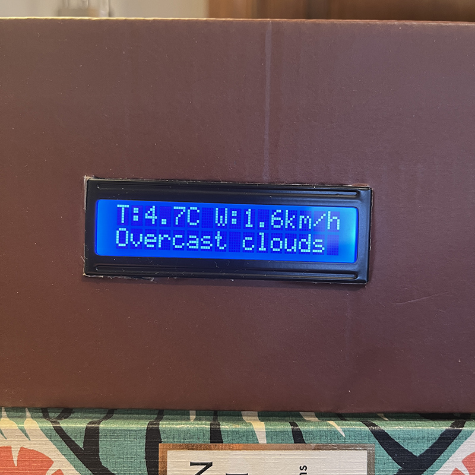
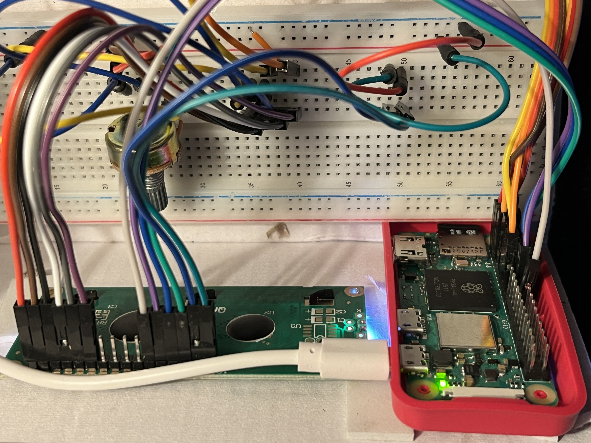
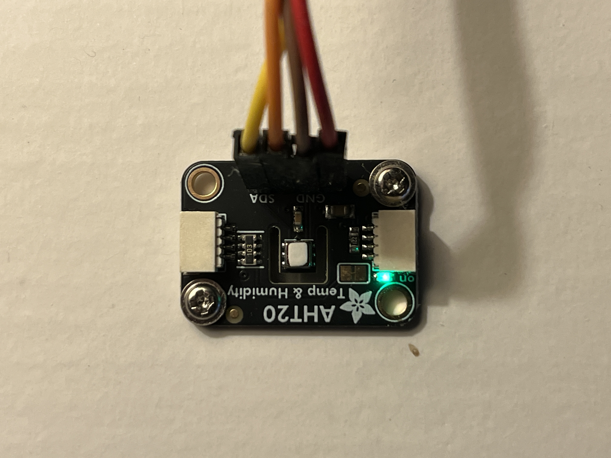

Raspberry Pi AHT20 Weather and Comfort Station

This project is a small Raspberry Pi setup that monitors indoor temperature and humidity using an AHT20 sensor. The data is shown on a 16x2 LCD, stored locally in an SQLite database, and combined with outdoor weather information from the OpenWeatherMap API.

It is designed to run continuously, be easy to understand, and stay reliable without unnecessary complexity.

What it does

- Reads temperature and humidity from an AHT20 sensor over I2C
- Displays rotating information screens on a 16x2 LCD
- Shows a comfort message based on the current temperature
- Displays the current time
- Fetches outdoor weather data (temperature and wind speed)
- Logs readings to a local SQLite database every 10 minutes
- Uses caching to reduce weather API calls
- Handles sensor read errors

Hardware used

- Raspberry Pi (tested on Raspberry Pi Zero 2 W)
- AHT20 temperature and humidity sensor
- 16x2 HD44780-compatible LCD
- Potentiometer for LCD contrast
- Jumper wires

Software requirements

- Raspberry Pi OS
- Python 3.9 or newer
- I2C enabled on the Raspberry Pi

Required Python packages

pip install adafruit-circuitpython-ahtx0 RPLCD python-dotenv requests

Setup

Enable I2C using:

sudo raspi-config

Go to Interface Options, enable I2C, then reboot.

Instructions:

Clone the repo.

Create a .env file in the project directory:

OPENWEATHER_API_KEY=your_api_key_here

You can get an API key from https://openweathermap.org/api

Weather configuration

Weather data is fetched from OpenWeatherMap.
For fixed installations, using latitude and longitude instead of a city name is recommended, as it avoids ambiguity and gives more reliable results.

Weather data is cached for 10 minutes to avoid unnecessary API requests.

Database

Sensor readings are stored in a local SQLite database.

Default database path:

/home/youruser/aht20_data.sqlite

The database contains a single table:

readings
- id
- timestamp
- temperature_c
- humidity_percent

LCD behavior

The LCD cycles through the following screens:

- Indoor temperature and humidity
- Comfort message based on temperature
- Current time
- Outdoor weather information

Display durations can be adjusted in the configuration section at the top of the script.

The script allows easy adjustment of:

- Logging interval
- LCD screen durations
- Temperature calibration offset
- Weather cache duration

Images:

LCD showing temperature and humidity:

Setup:

AHT20 temperature and humidity sensor:

Future ideas

- Web dashboard for viewing data
- Graphing historical readings
- Additional sensors
- Remote data syncing

License

MIT License
